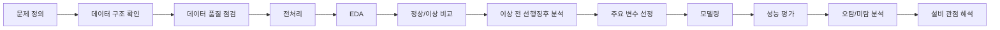

# 🔥 Heat Treatment Anomaly Prediction

> **열처리 공정 데이터를 활용한 이상 징후 사전 탐지 및 예측 팀 프로젝트**


---

## 1. 프로젝트 한 줄 요약

열처리 공정의 센서·공정 데이터를 분석하여 **정상 상태와 이상 상태의 차이를 확인하고, 이상 발생 이전에 나타나는 변화가 있는지 탐색한 뒤 사전 탐지 또는 예측 가능성을 검토**합니다.

> 현재 세부 목표, 정상/이상 정의, 예측 대상은 데이터 검토와 팀 결정에 따라 확정합니다.  
> 데이터로 확인되지 않은 고장 원인은 단정하지 않고 **관찰 사실 / 해석 / 가설**을 구분합니다.

---

## 2. 문제 정의

설비 이상은 실제 고장 발생 시점에만 탐지하는 것보다 **고장 이전의 변화 구간을 먼저 찾는 것**이 예지보전 관점에서 중요합니다.

이 프로젝트에서는 다음 질문에 답하는 것을 목표로 합니다.

1. 정상 구간과 이상 구간은 어떤 변수에서 차이를 보이는가?
2. 이상 발생 직전에 반복적으로 나타나는 패턴이 있는가?
3. 특정 센서가 다른 센서보다 먼저 변하는가?
4. 이상을 사전에 탐지할 수 있는 기준 또는 모델을 만들 수 있는가?
5. 모델 결과를 실제 설비 관리 관점에서 어떻게 해석할 수 있는가?

---

## 3. 프로젝트 목표

### 핵심 목표

- 데이터 구조 및 품질 파악
- 정상/이상 또는 변화 구간 정의
- 주요 변수의 분포와 시간 변화 분석
- 이상 발생 전 선행 징후 탐색
- 필요 시 이상탐지/분류 모델 적용
- 성능 평가 및 오탐·미탐 분석
- 설비 관리 및 예지보전 관점의 의미 정리

### 아직 확정이 필요한 항목

| 항목 | 상태 | 내용 |
|---|---|---|
| 최종 세부 주제 | 🟡 검토 중 | 이상구간 사전 탐지/예측 중심 |
| 정상/이상 정의 | 🟡 확인 필요 | 데이터 기준으로 확정 |
| 예측 대상 `y` | 🟡 확인 필요 | 고장/불량/이상 이벤트 등 검토 |
| 예측 선행시간 | 🟡 확인 필요 | 데이터 시간 단위 확인 후 결정 |
| 최종 평가 지표 | 🟡 확인 필요 | 문제 정의 후 Precision/Recall/F1 등 선택 |
| 최종 모델 | 🟡 확인 필요 | 베이스라인 이후 비교 |

---

## 4. 분석 흐름



---

## 5. 데이터

| 항목 | 내용 |
|---|---|
| 출처 | KAMP 열처리 품질보증 AI 데이터셋 `data.csv` |
| 규모 | 약 294만 행, 21개 컬럼(시각 + 배정번호 + 센서 19개) |
| 기간 | 2022년 1~7월, 작업(배정번호) 136개 |
| 주 대상 | 솔트조 온도 1·2존 |
| 비교·보조 | 소입로 온도 1~4존, 소입 OP·CP(해석 보조) |

> 원본 데이터는 저장소에 포함하지 않습니다. (`data/raw/` 는 `.gitignore` 처리)

### 자료 사용 원칙 (시간순 분리)

| 기간 | 작업 수 | 용도 |
|---|---:|---|
| 1~4월 | 78 | 온도 특성 파악, 기준 작성, 모델 학습 |
| 5월 | 22 | 판정 조건 점검·조정 |
| 6~7월 | 36 | 확정된 조건으로 후속 비교 |

각 작업은 첫 기록 시각이 속한 월에 배정하고, 자료를 무작위로 섞지 않습니다.

---

## 6. 분석 Notebook

| 순서 | Notebook | 목적 |
|---:|---|---|
| 01 | `01_data_understanding.ipynb` | 데이터 구조·컬럼·결측·중복·기초 통계 확인 |
| 02 | `02_preprocessing.ipynb` | 타입 변환, 결측/이상치 정책, 분석용 데이터 생성 |
| 03 | `03_eda.ipynb` | 분포, 시간 변화, 변수 관계, 정상/이상 비교 |
| 04 | `04_anomaly_window_analysis.ipynb` | 이상 발생 전 구간 및 선행 변화 탐색 |
| 05 | `05_modeling.ipynb` | 베이스라인 및 후보 모델 학습 |
| 06 | `06_evaluation_interpretation.ipynb` | 성능, 오탐/미탐, 변수 중요도 및 설비 관점 해석 |

> Notebook은 번호 순서대로 실행 흐름을 이해할 수 있도록 구성합니다.

---

## 7. 모델링 방향

모델을 먼저 정하지 않고 **문제 정의 → 데이터 특성 → 평가 기준** 순으로 선택합니다.

### 후보 접근법

**A. 정답 라벨이 명확한 경우**
- Logistic Regression: 해석 가능한 베이스라인
- Decision Tree / Random Forest: 비선형 관계 및 변수 중요도 확인
- Gradient Boosting 계열: 성능 비교 후보

**B. 이상 라벨이 부족하거나 불명확한 경우**
- 통계적 임계값
- Isolation Forest
- 정상 구간 기반 이상 점수

**C. 시간 순서가 핵심인 경우**
- Rolling mean / std
- 변화율
- 이동 구간 특징량
- 이상 발생 전 `N`분/초 구간 비교

> 복잡한 모델은 설명 가능성과 실제 필요성이 있을 때만 추가합니다.

---

## 8. 평가 방법

Accuracy 하나만 사용하지 않고, 프로젝트 목표에 맞는 지표를 선택합니다.

| 지표 | 의미 | 프로젝트 관점 |
|---|---|---|
| Precision | 이상이라고 판단한 것 중 실제 이상 비율 | 오탐 관리 |
| Recall | 실제 이상 중 찾아낸 비율 | 미탐 관리 |
| F1-score | Precision과 Recall의 균형 | 종합 비교 |
| Confusion Matrix | TP/FP/FN/TN 확인 | 오탐·미탐 원인 분석 |
| ROC-AUC / PR-AUC | 분류 경계 전반의 성능 | 필요 시 보조 지표 |

설비 고장 예측에서는 **미탐(FN)** 과 **오탐(FP)** 의 비용이 다를 수 있으므로 숫자만 비교하지 않고 의미를 함께 해석합니다.

---

## 9. 프로젝트 진행 중 의사결정

- 초기에는 월별 불량률 상관분석을 시도했으나, IQR·Z-score·RF·ANN 모두에서 유의미한 관계를 찾지 못했습니다. 보유 데이터가 온도뿐이고 설비 간 시간 동기화·불량 기준 정보가 없다는 한계를 확인하고, **조사 우선순위 지원**으로 문제를 재정의했습니다.
- 평가 지표가 실제 고장 적중률로 오해되지 않도록 범위와 해석의 한계를 문서에 명시했습니다.

## 9. 진행 현황 (2026-10-02 기준)

| 단계 | 내용 | 상태 |
|---|---|---|
| 1단계 | 원본 점검, 공통 읽기 규칙 (`src/data_contract.py`) | 완료 |
| 2단계 | 평소 모습: 작업별·월별·기간별 온도 통계 (`온도특성.xlsx`) | 코드·통계 생성·검증 완료 |
| 3단계 | 이상 구간 탐지 (직전 10분 / 고정 기준) | 예정 |
| 4단계 | Isolation Forest | 예정 |
| 5단계 | 평가 (사람 검토표 vs 탐지 결과, 혼동행렬·Precision·Recall·F1) | 계획 |

## 10. 프로젝트 구조

```text
heat-treatment-anomaly-prediction/
│
├── README.md
├── PROJECT_GUIDE.md
├── TEAM_WORKFLOW.md
├── GITHUB_SETUP_CHECKLIST.md
├── CONTRIBUTING.md
├── requirements.txt
├── .gitignore
│
├── .github/
│   ├── PULL_REQUEST_TEMPLATE.md
│   └── ISSUE_TEMPLATE/
│       └── analysis-task.md
│
├── data/
│   ├── README.md
│   ├── raw/
│   └── processed/
│
├── notebooks/
│   ├── README.md
│   ├── 01_data_understanding.ipynb
│   ├── 02_preprocessing.ipynb
│   ├── 03_eda.ipynb
│   ├── 04_anomaly_window_analysis.ipynb
│   ├── 05_modeling.ipynb
│   └── 06_evaluation_interpretation.ipynb
│
├── src/
│   ├── __init__.py
│   └── config.py
│
├── images/
│   ├── eda/
│   ├── model/
│   └── presentation/
│
├── results/
│   ├── README.md
│   └── metrics_template.csv
│
└── docs/
    ├── README.md
    └── presentation_outline.md
```

---

## 11. Git 협업 규칙

### 브랜치

- `main`: 발표/제출 가능한 안정 버전
- `feature/data-check`: 데이터 확인 작업
- `feature/preprocessing`: 전처리 작업
- `feature/eda`: EDA 작업
- `feature/anomaly-analysis`: 이상구간 분석
- `feature/modeling`: 모델링
- `docs/readme`: README 및 문서 작업

### 기본 흐름

```text
Issue 생성
→ 작업 브랜치 생성
→ 분석/수정
→ Commit
→ Push
→ Pull Request
→ 팀원 확인
→ main 병합
```

처음 프로젝트인 만큼 `develop` 브랜치까지 추가하지 않고 단순하게 운영합니다.

---

## 12. Commit 규칙

| Prefix | 사용 예 |
|---|---|
| `feat:` | 새로운 분석/기능 추가 |
| `fix:` | 오류 수정 |
| `data:` | 데이터 처리 변경 |
| `eda:` | 탐색적 분석 추가 |
| `model:` | 모델 관련 변경 |
| `viz:` | 시각화 추가/수정 |
| `docs:` | README/PPT/문서 수정 |
| `refactor:` | 결과 변화 없이 코드 구조 개선 |

예시:

```bash
git commit -m "eda: 정상과 이상 구간 온도 분포 비교"
git commit -m "data: 결측치 처리 기준 적용"
git commit -m "model: random forest 베이스라인 추가"
git commit -m "docs: 핵심 분석 결과 README 반영"
```

---

## 13. 팀 협업 원칙

1. 한 사람이 모든 분석을 독점하지 않는다.
2. 담당자는 작업을 주도하되 팀원이 결과와 이유를 이해하도록 공유한다.
3. 중요한 분석 결정은 Issue 또는 회의 기록에 남긴다.
4. `main`에 바로 큰 수정사항을 올리지 않는다.
5. 그래프에는 반드시 “무엇을 보기 위한 그래프인지”를 설명한다.
6. 모델 결과는 성능 숫자로 끝내지 않고 오탐/미탐을 확인한다.
7. 발표에 사용할 분석은 팀원 모두가 최소한 설명할 수 있어야 한다.

---

## 14. 사용 기술

- Python
- Pandas
- NumPy
- Matplotlib
- Seaborn
- Scikit-learn
- Jupyter Notebook
- Git / GitHub

> 실제 사용하지 않은 라이브러리는 최종 README에서 제거합니다.

---

## 15. 발표 자료

최종 발표자료는 `docs/`에 PDF 형태로 저장할 예정입니다.

발표 흐름:

```text
문제 정의
→ 프로젝트 목적
→ 데이터 설명
→ 분석 전략
→ 정상/이상 비교
→ 이상 전 선행징후
→ 모델링
→ 성능 및 오탐/미탐
→ 설비 관점 해석
→ 결론 및 한계
```

---

## 16. 팀 (2조)

| 이름 | 담당 |
|---|---|
| 남정곤 (조장) | 1단계 전처리 공통 읽기 함수·점검 코드, 분석 계획·단계 진행판 문서 |
| 강승민 | 팀 빌딩, 솔트조 시각화 |
| 김동형 | 2단계 평소 모습 코드·`온도특성.xlsx` |
| 김도진 | 설비별 OP·CP 용어 정리 |
| 최정후 | 2단계 평소 모습 분석 코드 |
> 역할은 책임 구분을 위한 것이며, 핵심 분석 과정은 팀 전체가 함께 이해합니다.

---

## 17. 프로젝트에서 가장 중요하게 보는 것

> **무엇을 했는가 → 왜 했는가 → 결과가 무엇을 의미하는가**

높은 모델 성능만을 목표로 하지 않고, 데이터에서 확인한 변화가 설비 이상 및 예지보전 문제와 어떻게 연결되는지를 설명할 수 있는 프로젝트를 목표로 합니다.

---

## 18. 현재 진행 상태

- [o] 데이터 구조 확인
- [o] 컬럼 의미 정리
- [o] 데이터 품질 점검
- [o] 정상/이상 정의
- [o] 전처리 기준 확정
- [o] EDA
- [o] 이상 전 변화구간 분석
- [o] 주요 변수 선정
- [o] 베이스라인 모델
- [o] 모델 비교
- [o] 오탐/미탐 분석
- [ ] 핵심 시각화 선정
- [ ] README 최종화
- [ ] 발표자료 완성

---
## 10. 실행 방법

KAMP에서 받은 `data.csv`를 `data/raw/`에 넣은 뒤, 프로젝트 최상위 폴더에서 실행합니다.

```powershell
python -m venv .venv
.\.venv\Scripts\pip install -r requirements.txt

.\.venv\Scripts\python.exe "stages/1단계_전처리/1단계_전처리_전체실행.py"
.\.venv\Scripts\python.exe "stages/2단계_평소모습/2단계_평소모습.py"
```

### Team Project · Predictive Maintenance / Anomaly Detection
